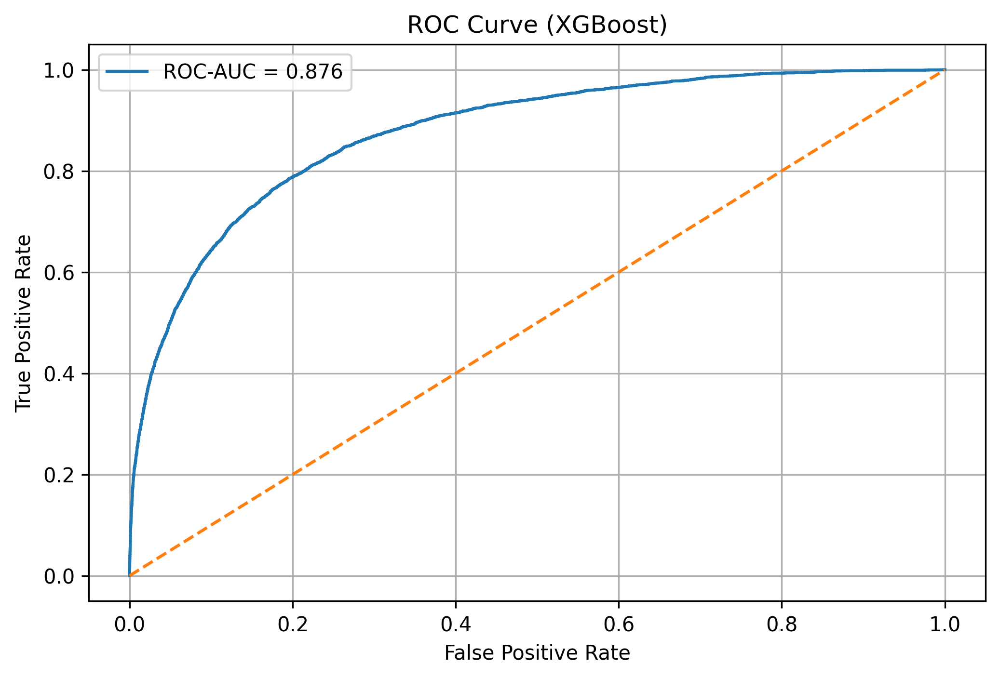
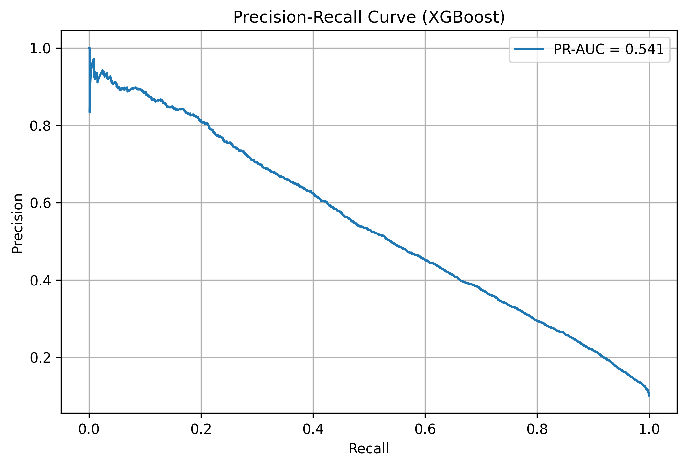
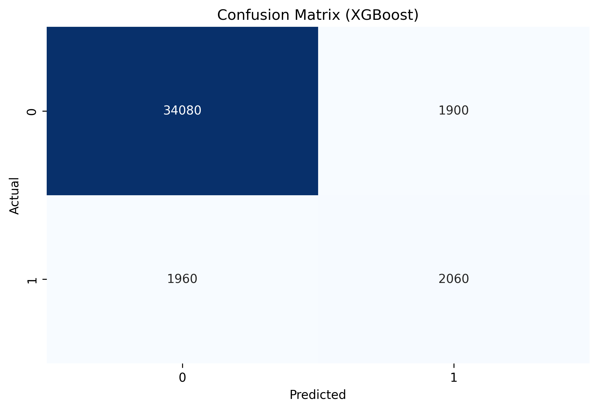

# Santander Customer Transaction Prediction

Binary classification project based on the Santander Customer Transaction Prediction Kaggle dataset, focused on predicting whether a customer will make a future transaction using anonymized numerical features.

The project explores end-to-end machine learning workflows including exploratory data analysis, class imbalance handling, model evaluation, hyperparameter optimization, and predictive performance analysis using Logistic Regression, Random Forest, and XGBoost.

---

# Project Objectives

- Explore and understand the structure of an anonymized tabular dataset
- Compare baseline and ensemble classification models
- Evaluate model performance under class imbalance conditions
- Analyze ROC-AUC, PR-AUC, precision and recall tradeoffs
- Study the impact of classification thresholds on predictive behavior
- Practice end-to-end machine learning workflows and model evaluation

---

# Dataset

The dataset comes from the Santander Customer Transaction Prediction Kaggle competition and contains anonymized numerical features.

Only the training dataset was used in this project.

The original Kaggle competition test dataset was intentionally not used for leaderboard submissions or competition ranking purposes, since the focus of this project was understanding machine learning workflows, model evaluation, and classification behavior rather than competition performance.

The analysis focused on:
- model comparison,
- class imbalance evaluation,
- threshold behavior,
- and predictive performance interpretation.

## Dataset Characteristics

- 200 anonymized numerical variables
- Binary target variable
- Imbalanced dataset
- No missing values detected
- Tabular dataset focused on binary classification

The official competition metric was ROC-AUC.

---

# Repository Structure

```text
├── notebooks/
│   ├── 01_eda.ipynb
│   ├── 02_logistic_regression.ipynb
│   ├── 03_random_forest.ipynb
│   └── 04_xgboost.ipynb
│
├── images/
├── README.md
```

---

# Model Performance

Three classification models were evaluated and compared:

- Logistic Regression (baseline model)
- Random Forest
- XGBoost

Performance was evaluated mainly using:
- ROC-AUC (official competition metric)
- PR-AUC (important under class imbalance)
- Recall and Precision
- Confusion Matrix analysis

## Model Comparison

| Model | Accuracy | ROC-AUC | PR-AUC | Recall (Class 1) |
|---|---|---|---|---|
| Logistic Regression | 0.783 | 0.860 | 0.500 | 0.78 |
| Random Forest | 0.903 | 0.832 | 0.424 | 0.05 |
| XGBoost | 0.904 | 0.876 | 0.541 | 0.51 |

## Key Observations

- Logistic Regression achieved strong recall despite being the simplest model.
- Random Forest produced high overall accuracy but performed poorly on the minority class due to severe class imbalance.
- XGBoost achieved the best overall ranking performance with the highest ROC-AUC and PR-AUC scores.
- PR-AUC proved especially useful for evaluating performance under imbalanced classification conditions.

---

# Hyperparameter Optimization

RandomizedSearchCV was used for Random Forest and XGBoost hyperparameter optimization using a stratified 10% sample of the dataset in order to reduce computational cost.

The best XGBoost configuration included:
- Regularization parameters (`gamma`, `reg_lambda`)
- Controlled tree depth
- Subsampling strategies
- Balanced class weighting

Future improvements may include:
- Bayesian optimization
- Additional feature engineering and exploratory analysis of feature distributions.

---

# XGBoost Results

## ROC Curve



The XGBoost model achieved a ROC-AUC score of approximately 0.876, showing strong ranking capability between positive and negative classes.

---

## Precision-Recall Curve



The PR-AUC score of approximately 0.541 highlighted improved minority class detection performance under class imbalance conditions.

---

## Confusion Matrix (Threshold = 0.5)



Using the default threshold of 0.5, the model achieved balanced overall performance while remaining relatively conservative in positive class predictions.

---


